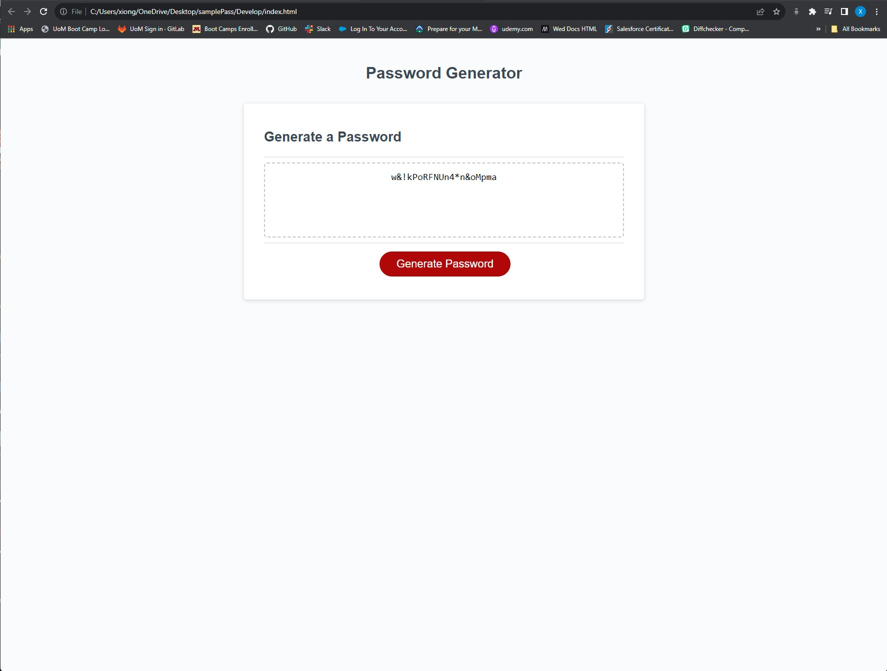

# Challenge 03 JavaScript: Password Generator

* The program will generate a password based on user preferences. Depending on the users input to the alerts that is provided for the user to interact with.

* When starting this program, the program will give you a alert to choose how long you would like your password. Choose a number between
8 characters and 128 characters. Any number that is inputed that is less then 8, or more than 128 character you will be given an alert that you 
must meet the requirement, and be given the chance to choose your password length again.

* The program will also give you four alerts. You the user will have to choose during each alert if you want to include upper case, lower case, numbers or special keys in your random password by clicking "OK" to add or "CANCEL" to not add. You must at least choose one option or else you will be given a alert that you have not met the requirements and must start over.

# Screen shot of Password Generator 

# Link to deployed application
